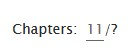

# ArchiveOfOurOwn 'Jump To Last Chapter' Userscript

This is a simple userscript that runs on Archive of Our Own and inserts a link
so you can click on the chapter count to jump to the last chapter.

To use, you'll need a user script extension, like ViolentMonkey or TamperMonkey
installed in your browser. I wrote a tutorial on
[making your own userscripts for Ao3 here](https://seanzwrites.com/posts/creating-custom-filters-on-ao3/)
that covers how to install and write your own userscript.

To use this, open your userscript editor (likely by clicking on the icon), hitting `New User Script`, and pasting in the contents of `jumpToLastChapter.js`

